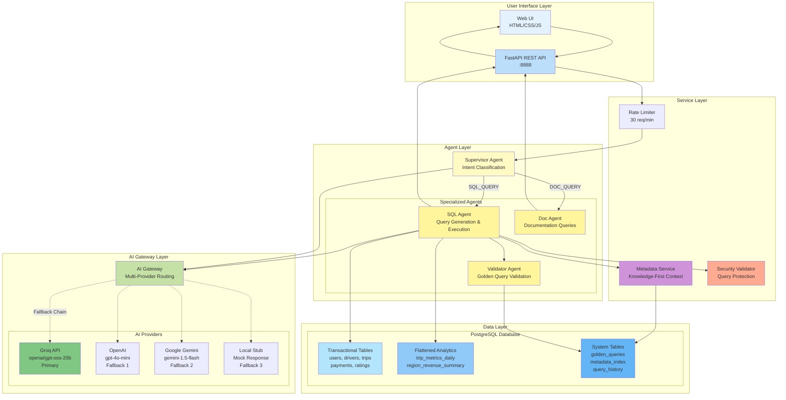

# Multi-Agent Architecture - Finch AI

## Kiến trúc Multi-Agent System



## Chi tiết các Agent

### 🎯 **Supervisor Agent**

**Nhiệm vụ:** Intent Classification - Phân loại ý định người dùng

**Input:**
- User question (string)

**Process:**
1. Gọi AI Gateway với system prompt classification
2. Phân tích question để xác định intent type
3. Return intent: `SQL_QUERY`, `DOC_QUERY`, hoặc `UNCLEAR`

**Output:**
- Intent type + confidence score
- Route to appropriate agent

**AI Configuration:**
- Temperature: 0.7 (balanced)
- Max tokens: 500

---

### 📊 **SQL Agent**

**Nhiệm vụ:** Generate và Execute SQL queries

**Input:**
- User question
- Database session

**Process:**
1. **Build Context** (Knowledge-First Approach)
   - Search metadata_index for relevant tables/columns
   - Get business term mappings
   - Build comprehensive context package

2. **Generate SQL**
   - Call AI Gateway with context + question
   - System prompt: SQL expert instructions
   - Extract SQL from AI response

3. **Validate SQL**
   - Security check (blocked keywords)
   - Syntax validation
   - Read-only verification

4. **Execute SQL**
   - Run against PostgreSQL with timeout
   - Fetch results as JSON
   - Handle errors with rollback

5. **Calculate Confidence**
   - Parse AI response for confidence indicators
   - Return score 0.0-1.0

**Output:**
```json
{
  "sql": "SELECT ...",
  "explanation": "...",
  "confidence_score": 0.9,
  "results": [...],
  "row_count": 5,
  "error": null
}
```

**AI Configuration:**
- Temperature: 0.3 (low for consistency)
- Max tokens: 1000

---

### 📚 **Doc Agent**

**Nhiệm vụ:** Answer documentation/business questions

**Input:**
- User question
- Database session

**Process:**
1. Search metadata_index for relevant docs
2. Build documentation context
3. Call AI Gateway with context
4. Generate natural language answer

**Output:**
```json
{
  "answer": "USNC stands for...",
  "confidence_score": 0.95,
  "sources": ["metadata_index"]
}
```

**AI Configuration:**
- Temperature: 0.7
- Max tokens: 800

---

### ✅ **Validator Agent**

**Nhiệm vụ:** Validate SQL queries against Golden Queries

**Input:**
- User question
- Generated SQL
- Query results

**Process:**
1. Search golden_queries table for similar questions
2. Compare generated SQL with golden SQL
3. Calculate similarity score
4. Check result structure match

**Output:**
```json
{
  "trust_score": 0.85,
  "validation_notes": [
    "Similar to golden query #3",
    "Result structure matches"
  ],
  "matched_golden_id": 3
}
```

**Configuration:**
- Similarity threshold: 0.7
- Max golden queries to check: 10

---

## Service Components

### 🔍 **Metadata Service**

**Nhiệm vụ:** Knowledge-First Context Building

**Capabilities:**
- Search metadata by keywords
- Resolve business terms (USNC → US and Canada)
- Get table schemas
- Build context for SQL generation

**Database Tables:**
- `metadata_index`: Column descriptions, business terms

---

### 🛡️ **Security Validator**

**Nhiệm vụ:** Query Security & Protection

**Checks:**
- Blocked keywords: DROP, DELETE, UPDATE, INSERT, ALTER, CREATE, TRUNCATE
- Multiple statement detection
- SQL injection patterns
- Comment abuse (--,  /*, */)

**Execution Safety:**
- Statement timeout: 5 seconds
- Transaction rollback on error
- Read-only enforcement

---

### ⏱️ **Rate Limiter**

**Nhiệm vụ:** Prevent API abuse

**Configuration:**
- Max requests: 30 per minute (configurable)
- Window: 60 seconds
- Identifier: Client IP address

**Storage:**
- In-memory dict (production: use Redis)

---

## AI Gateway

### Provider Selection Strategy

```python
DEFAULT_PROVIDER = "groq"  # From .env

FALLBACK_ORDER = [
    AIProvider.GROQ,      # Free, ultra-fast (openai/gpt-oss-20b)
    AIProvider.OPENAI,    # Fallback 1 (gpt-4o-mini)
    AIProvider.GEMINI,    # Fallback 2 (gemini-1.5-flash)
    AIProvider.LOCAL      # Fallback 3 (always succeeds)
]
```

### Request Flow

1. Try primary provider (Groq)
2. On failure, try next in fallback chain
3. Track usage per provider
4. Return result with provider info

### Configuration

```python
{
    "model": "openai/gpt-oss-20b",  # Groq
    "temperature": 0.3-0.7,          # Agent-specific
    "max_tokens": 500-1000,          # Agent-specific
    "timeout": 30                     # seconds
}
```

---

## Data Flow Example

### Question: "Show me top 5 drivers by total earnings"

```
1. UI → API: POST /chat {"question": "..."}
2. API → RateLimiter: Check IP
3. RateLimiter → Supervisor: OK, proceed
4. Supervisor → AI Gateway: Classify intent
5. AI Gateway → Groq: "Classify this question..."
6. Groq → AI Gateway: "SQL_QUERY"
7. Supervisor → SQLAgent: Route to SQL
8. SQLAgent → MetadataService: Build context
9. MetadataService → DB: Search metadata
10. DB → MetadataService: Schema info
11. SQLAgent → AI Gateway: Generate SQL
12. AI Gateway → Groq: "Generate SQL for..."
13. Groq → AI Gateway: "SELECT d.name, d.total_earnings..."
14. SQLAgent → SecurityValidator: Validate
15. SecurityValidator → SQLAgent: Valid
16. SQLAgent → DB: Execute SQL
17. DB → SQLAgent: Results [5 rows]
18. SQLAgent → ValidatorAgent: Validate
19. ValidatorAgent → DB: Check golden queries
20. DB → ValidatorAgent: Trust score 0.85
21. SQLAgent → API: Response
22. API → UI: JSON response
```

## Performance Characteristics

| Component | Avg Time | Notes |
|-----------|----------|-------|
| Rate Limiter | <1ms | In-memory check |
| Supervisor Classification | ~500ms | Groq API call |
| Metadata Search | ~10-50ms | DB query |
| SQL Generation | ~800ms | Groq API call |
| SQL Execution | ~10-20ms | PostgreSQL query |
| Golden Validation | ~5ms | DB lookup |
| **Total** | **~1.3-1.5s** | End-to-end |

## Scalability Considerations

- **AI Gateway**: Handles provider failures gracefully
- **Rate Limiter**: Can move to Redis for multi-instance
- **Database**: Connection pooling (async)
- **Agents**: Stateless, can scale horizontally
