# Data Flow Diagram - Finch AI

## Luồng dữ liệu từ User Question đến Final Answer

### Overview Flow

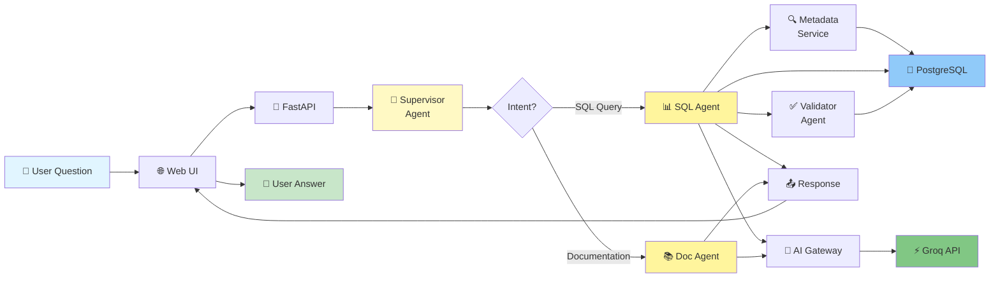

---

## Detailed Data Flow

### 1️⃣ User Input → Web UI

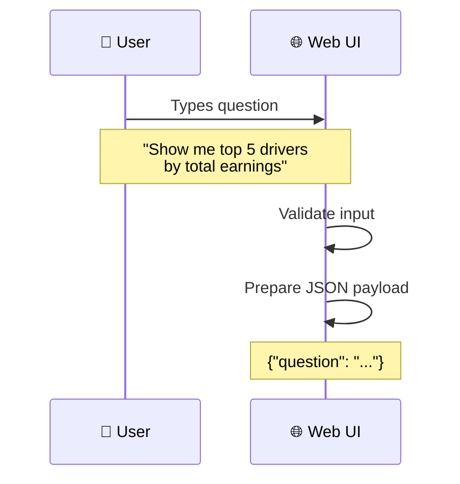

**Data Format:**
```javascript
{
  question: "Show me top 5 drivers by total earnings"
}
```

---

### 2️⃣ Web UI → FastAPI

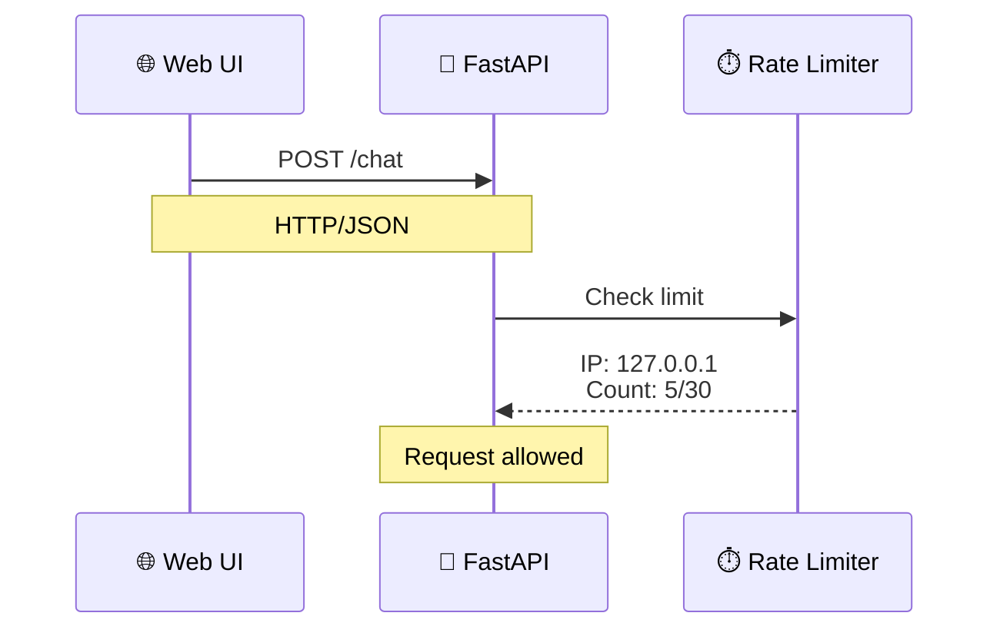

**HTTP Request:**
```http
POST /chat HTTP/1.1
Content-Type: application/json

{
  "question": "Show me top 5 drivers by total earnings"
}
```

---

### 3️⃣ Supervisor Classification

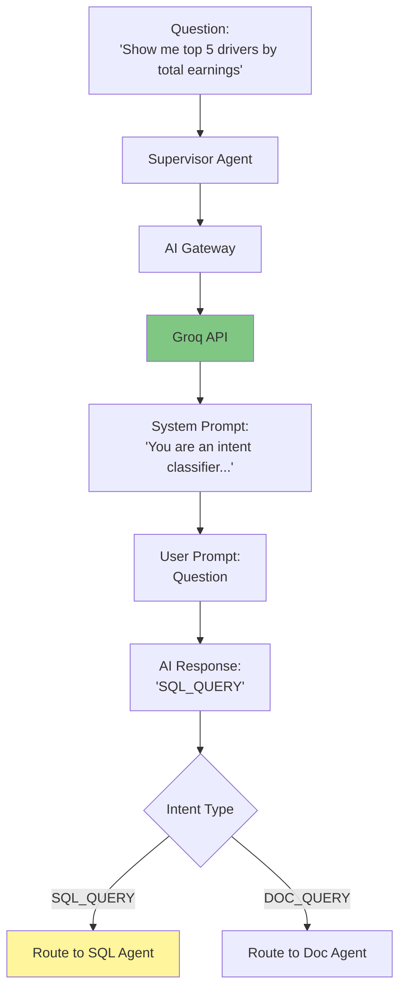

**AI Request to Groq:**
```json
{
  "model": "openai/gpt-oss-20b",
  "messages": [
    {
      "role": "system",
      "content": "You are an intent classifier. Determine if this is a SQL_QUERY or DOC_QUERY."
    },
    {
      "role": "user",
      "content": "Question: Show me top 5 drivers by total earnings"
    }
  ],
  "temperature": 0.7
}
```

**AI Response:**
```
Intent: SQL_QUERY
Confidence: 0.95

This is a data query requesting specific records from the database.
```

---

### 4️⃣ SQL Agent - Build Context

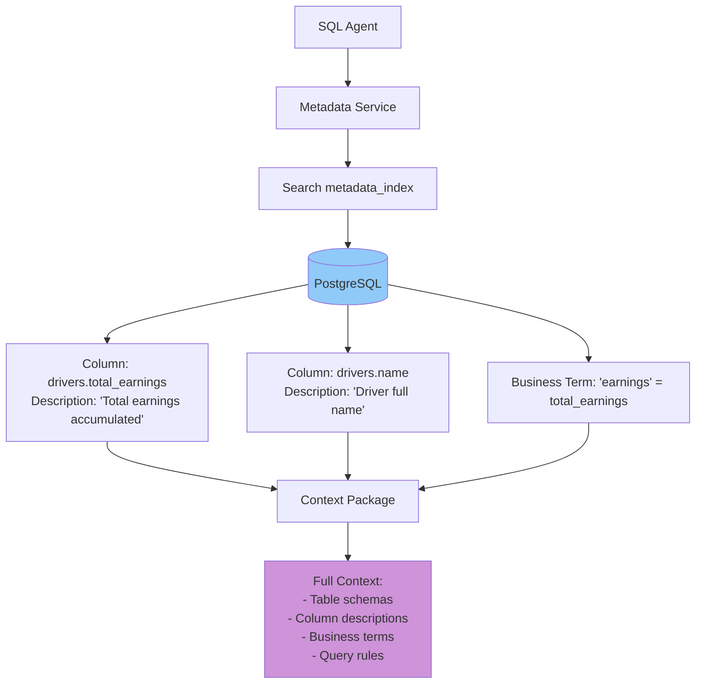

**Context Built:**
```markdown
# DATABASE CONTEXT

## Transactional Tables:
- drivers: id, name, email, total_earnings, rating, region_id
  ⚠️ drivers table has name/email directly, NO user_id!

## Important Rules:
1. For INDIVIDUAL driver queries, USE drivers table
2. ORDER BY for top/best queries
3. Use LIMIT for result count

## Business Terms:
- earnings = total_earnings column
```

---

### 5️⃣ SQL Agent - Generate SQL

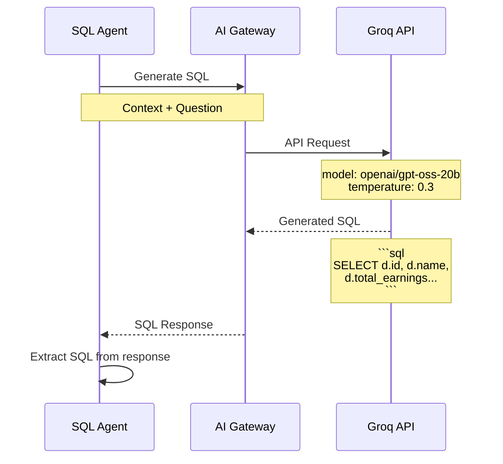

**AI Request:**
```json
{
  "model": "openai/gpt-oss-20b",
  "messages": [
    {
      "role": "system",
      "content": "You are an expert SQL generator..."
    },
    {
      "role": "user",
      "content": "[CONTEXT]\n\nQuestion: Show me top 5 drivers by total earnings"
    }
  ],
  "temperature": 0.3,
  "max_tokens": 1000
}
```

**AI Response:**
```sql
SELECT
    d.id,
    d.name,
    d.total_earnings,
    r.code AS region_code
FROM
    drivers d
LEFT JOIN
    regions r ON d.region_id = r.id
ORDER BY
    d.total_earnings DESC
LIMIT 5;
```

**Explanation:** This query retrieves the top 5 drivers by total earnings...

**Confidence:** High

---

### 6️⃣ Security Validation

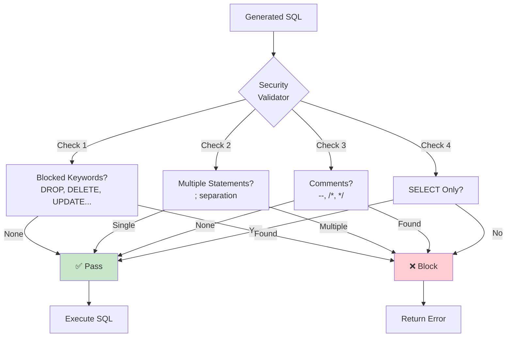

**Validation Result:**
```json
{
  "is_valid": true,
  "error_message": null,
  "checks_passed": [
    "No blocked keywords",
    "Single statement",
    "No comments",
    "SELECT only"
  ]
}
```

---

### 7️⃣ SQL Execution

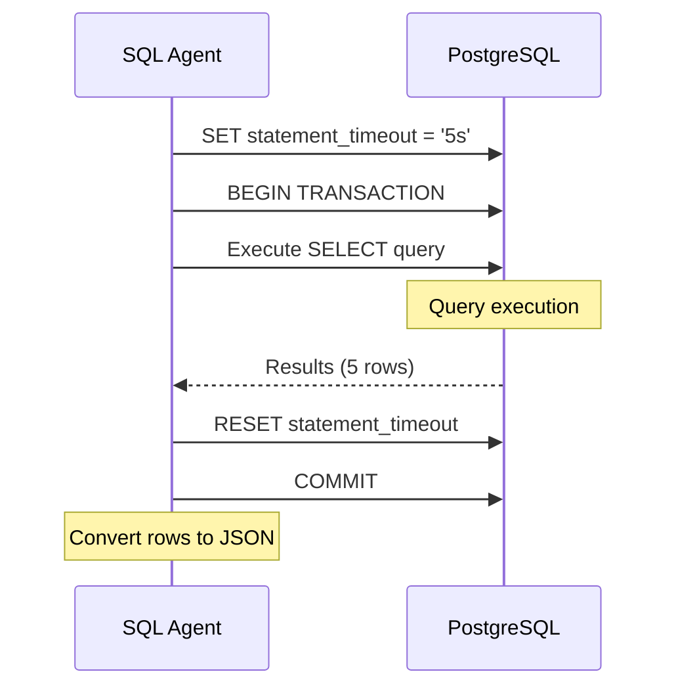

**Database Query:**
```sql
SET statement_timeout = '5s';

SELECT
    d.id,
    d.name,
    d.total_earnings,
    r.code AS region_code
FROM drivers d
LEFT JOIN regions r ON d.region_id = r.id
ORDER BY d.total_earnings DESC
LIMIT 5;

RESET statement_timeout;
```

**Results:**
```json
[
  {
    "id": 456,
    "name": "John Smith",
    "total_earnings": "15234.50",
    "region_code": "USNC"
  },
  {
    "id": 789,
    "name": "Maria Garcia",
    "total_earnings": "14890.25",
    "region_code": "USNE"
  },
  ...
]
```

---

### 8️⃣ Validator Agent - Golden Query Check

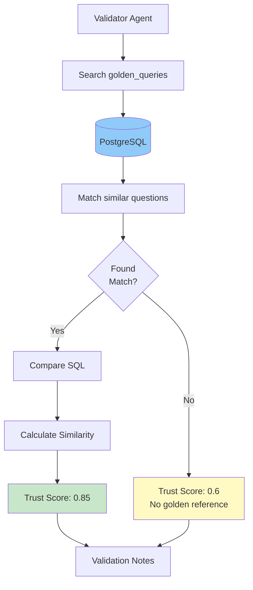

**Golden Query Search:**
```sql
SELECT * FROM golden_queries
WHERE question ILIKE '%top%driver%earning%'
ORDER BY created_at DESC
LIMIT 5;
```

**Validation Result:**
```json
{
  "trust_score": 0.85,
  "validation_notes": [
    "Similar to golden query #3",
    "SQL structure matches best practice",
    "Result count appropriate"
  ],
  "matched_golden_id": 3
}
```

---

### 9️⃣ Save Query History

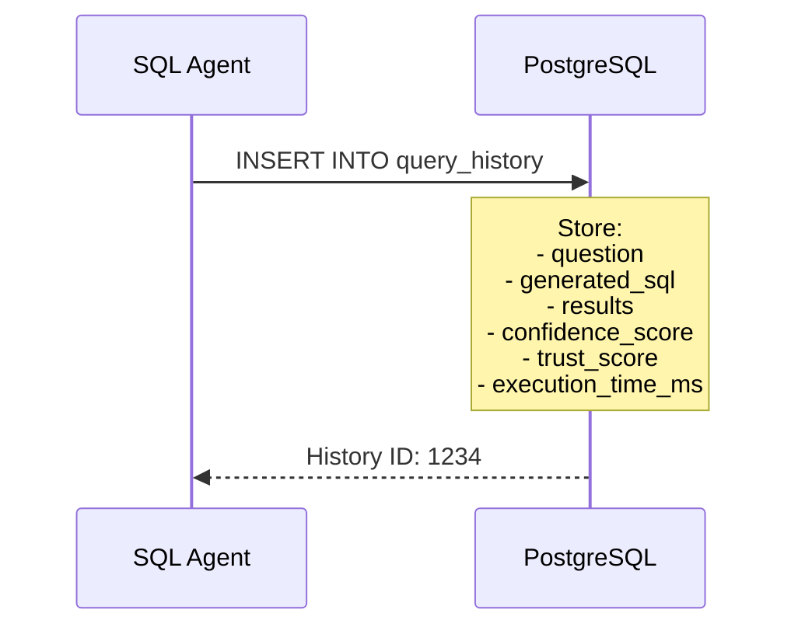

**Insert:**
```sql
INSERT INTO query_history (
  user_question,
  generated_sql,
  execution_result,
  confidence_score,
  trust_score,
  agent_used,
  execution_time_ms
) VALUES (
  'Show me top 5 drivers by total earnings',
  'SELECT d.id, d.name...',
  '[{"id": 456, "name": "John Smith"...}]',
  0.9,
  0.85,
  'sql_agent',
  1550
);
```

---

### 🔟 Build Final Response

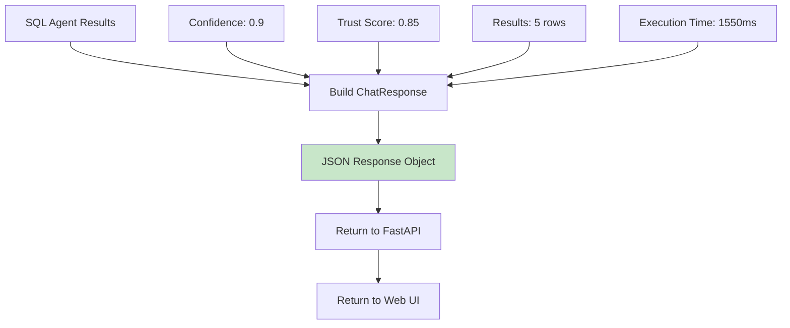

**Final Response:**
```json
{
  "question": "Show me top 5 drivers by total earnings",
  "agent_used": "sql_agent",
  "sql": "SELECT d.id, d.name, d.total_earnings, r.code AS region_code FROM drivers d LEFT JOIN regions r ON d.region_id = r.id ORDER BY d.total_earnings DESC LIMIT 5;",
  "explanation": "This query retrieves the top 5 drivers...",
  "answer": null,
  "results": [
    {
      "id": 456,
      "name": "John Smith",
      "total_earnings": "15234.50",
      "region_code": "USNC"
    },
    ...
  ],
  "row_count": 5,
  "confidence_score": 0.9,
  "trust_score": 0.85,
  "validation_notes": [
    "Similar to golden query #3",
    "SQL structure matches best practice"
  ],
  "error": null,
  "execution_time_ms": 1550
}
```

---

### 1️⃣1️⃣ Display to User

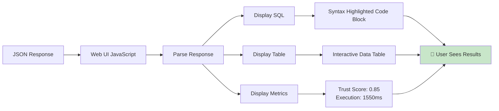

**UI Display:**
```
╔═══════════════════════════════════════╗
║  SQL Generated:                        ║
║  SELECT d.id, d.name, d.total_earnings║
║  FROM drivers d                        ║
║  ORDER BY d.total_earnings DESC        ║
║  LIMIT 5;                              ║
╠═══════════════════════════════════════╣
║  Results (5 rows):                     ║
║  ┌────┬──────────────┬────────────┐   ║
║  │ ID │ Name         │ Earnings   │   ║
║  ├────┼──────────────┼────────────┤   ║
║  │456 │ John Smith   │ $15,234.50 │   ║
║  │789 │ Maria Garcia │ $14,890.25 │   ║
║  └────┴──────────────┴────────────┘   ║
╠═══════════════════════════════════════╣
║  Trust Score: 0.85 ⭐⭐⭐⭐            ║
║  Execution Time: 1.55s                 ║
╚═══════════════════════════════════════╝
```

---

## Data Flow Summary

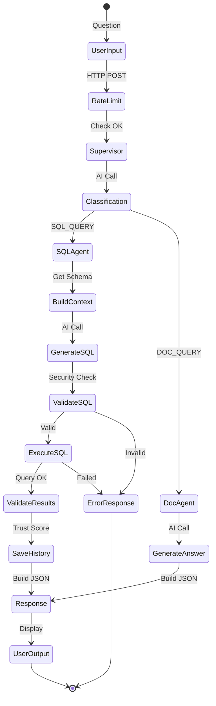

---

## Timing Breakdown

```
Total: ~1.5 seconds
├── Rate Limit Check: <1ms
├── Supervisor Classification: ~500ms
│   └── Groq API call
├── Build Context: ~50ms
│   └── Search metadata_index
├── Generate SQL: ~800ms
│   └── Groq API call
├── Validate SQL: <1ms
├── Execute SQL: ~20ms
│   └── PostgreSQL query
├── Validate Results: ~5ms
│   └── Golden query check
└── Save History: ~5ms
    └── Insert to query_history
```

---

## Data Size Flow

```
User Input:     ~50 bytes
  ↓
Context Built:  ~2 KB (metadata + rules)
  ↓
AI Request:     ~3 KB (context + prompt)
  ↓
AI Response:    ~500 bytes (SQL + explanation)
  ↓
SQL Query:      ~200 bytes
  ↓
DB Results:     ~1 KB (5 rows × ~200 bytes)
  ↓
Final Response: ~2 KB (all fields)
  ↓
User Display:   ~2 KB (rendered HTML)
```

---

**Total Data Transferred:** ~11 KB per query
