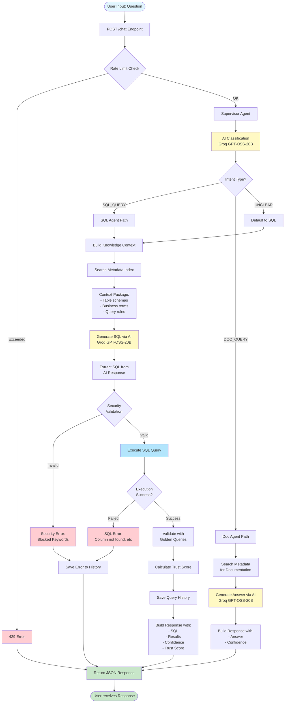

# Query Processing Flow - Finch AI

## Quá trình xử lý Query từ Input đến Output



## Chi tiết các bước

### 1. **API Endpoint** (`POST /chat`)
- Nhận `ChatRequest` với `question` từ user
- Bắt đầu timing để đo execution time

### 2. **Rate Limiting**
- Check client IP
- Limit: 30 requests/minute (configurable)
- Return 429 nếu exceed

### 3. **Supervisor Agent Classification**
- Gọi Groq API để classify intent
- Input: User question
- Output: `SQL_QUERY`, `DOC_QUERY`, hoặc `UNCLEAR`
- Temperature: 0.7 (balanced creativity)

### 4a. **SQL Agent Path** (for data queries)

#### 4a.1. Build Knowledge Context
- Search `metadata_index` table for relevant columns
- Extract business term mappings (USNC, EMEA, etc)
- Build context with:
  - Flattened analytics tables (trip_metrics_daily, region_revenue_summary)
  - Transactional tables (drivers, trips, users, etc)
  - Important rules for query generation

#### 4a.2. Generate SQL
- Call Groq API with:
  - System prompt: SQL expert instructions
  - User prompt: Context + Question
  - Temperature: 0.3 (low for consistency)
  - Model: `openai/gpt-oss-20b`
- Parse AI response to extract SQL query

#### 4a.3. Security Validation
- Check for blocked keywords: DROP, DELETE, UPDATE, INSERT, etc
- Verify it's a SELECT statement
- Set statement timeout: 5 seconds

#### 4a.4. Execute SQL
- Run query against PostgreSQL async
- Fetch results as list of dicts
- Rollback transaction on error

#### 4a.5. Validate with Golden Queries
- Search `golden_queries` table for similar questions
- Compare generated SQL with golden SQL
- Calculate similarity score
- Return trust score (0.0-1.0)

#### 4a.6. Save Query History
- Insert into `query_history` table
- Store: question, SQL, results, confidence, trust_score, execution_time
- Rollback if save fails (won't block response)

### 4b. **Doc Agent Path** (for documentation queries)

#### 4b.1. Search Metadata
- Search `metadata_index` for relevant documentation
- Get business term definitions

#### 4b.2. Generate Answer
- Call Groq API with documentation context
- Temperature: 0.7
- Return natural language explanation

### 5. **Build Response**
- Create `ChatResponse` object with:
  - `question`: Original user question
  - `agent_used`: "sql_agent" or "doc_agent"
  - `sql`: Generated SQL (if applicable)
  - `results`: Query results
  - `confidence_score`: Agent's confidence (0.0-1.0)
  - `trust_score`: Golden query validation score
  - `error`: Error message if any
  - `execution_time_ms`: Total processing time

### 6. **Return to User**
- JSON response with all data
- Frontend displays results in UI

## Error Handling

| Error Type | Action | Response |
|------------|--------|----------|
| Rate Limit | Return immediately | 429 status |
| Security Validation Failed | Save to history | Error in response |
| SQL Execution Failed | Rollback, save to history | Error in response |
| AI API Failed | Fallback to next provider | Continue with fallback |
| Save History Failed | Rollback, log error | Still return valid response |

## AI Provider Fallback Chain

```
Groq → OpenAI → Gemini → Local Stub
```

- Primary: Groq (openai/gpt-oss-20b) - Fast, free
- Fallback 1: OpenAI (gpt-4o-mini) - If Groq fails
- Fallback 2: Gemini (gemini-1.5-flash) - If OpenAI fails
- Fallback 3: Local stub - Always succeeds (mock response)

## Timing Breakdown (Typical)

1. Rate limit check: <1ms
2. Supervisor classification: ~500ms (Groq API)
3. Build context: ~10-50ms (DB queries)
4. SQL generation: ~800ms (Groq API)
5. SQL execution: ~10-20ms (DB query)
6. Golden validation: ~5ms (DB query)
7. Save history: ~5ms (DB insert)

**Total: ~1.3-1.5 seconds** per query
